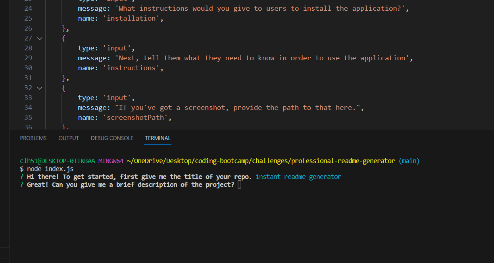

# instant-readme-generator

## Description

This application creates a professional README file in seconds based on the answers to some node.js prompts. The answers to the prompts are automatically organized into the proper format for a web app README. 

# Table of Contents 

- [Description](#description)

- [Installation](#installation)

- [Usage](#usage)

- [Contributions](#Contributions)

# Installation 

This application is completely web-based, and requires no installation steps for use. 

# Usage 

To use the application, first open a terminal for the index.js file. Once you are in the terminal, enter "node index.js." This will begin the questionnaire. After answering all of the questions, you'll receive a notification in the terminal that your README file has been generated. You'll find the README file in the same folder as your index.js file. 

# License

This application is covered under the MIT license.

# Contributions 

Users are welcome to contact me with contribution suggestions.. Contributions can be emailed to me at cleidy.developer@gmail.com.

If you have any questions or issues about the application, don't hesitate to reach out to me at cleidy.developer@gmail.com, or on GitHub at https://github.com/CollyLee

